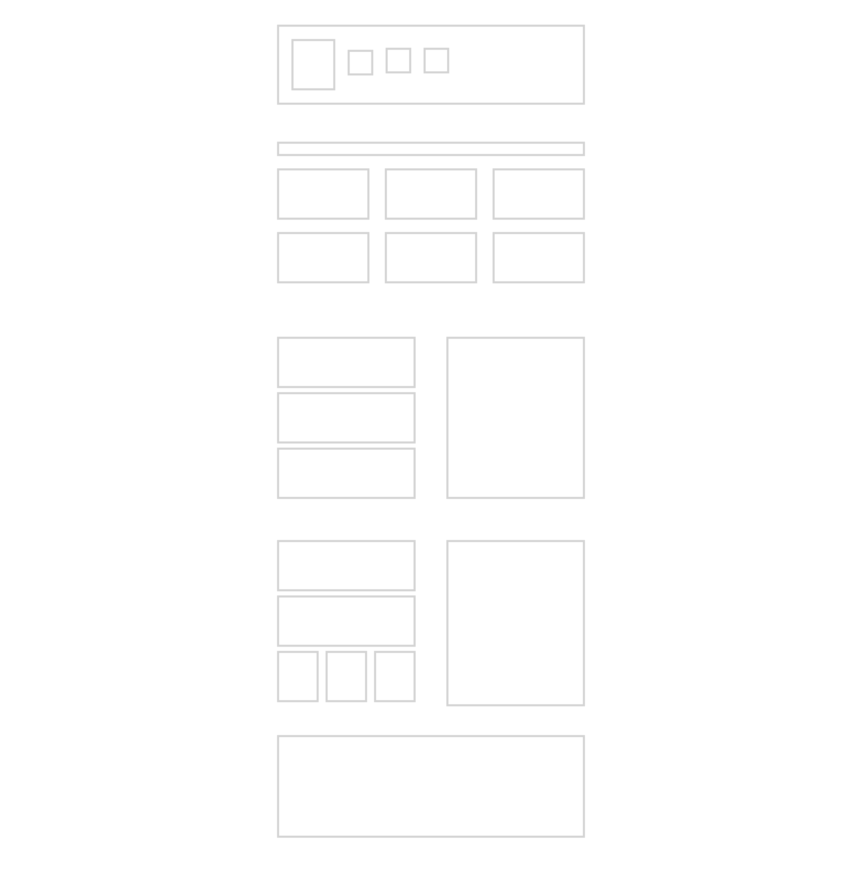

# ⭐ Common Layouts
 
This is a collection of simple common layouts built with CSS. You can view the project live on Codepen [Here](https://codepen.io/benjaminkyamanywa/pen/ExMjvJW). 

To practise the most common simplest CSS layouts in their simplest form without content.

This includes:
- Navigation bar
- Title with 2 rows items
- Side by side items
- Side by side items with smaller row items

## 🚀 Features

- **Common Layouts**: Layouts commonly used without content. Only structure.

## 🛠️ Technologies

- `HTML`
- `CSS`

## 📸 Screenshot

