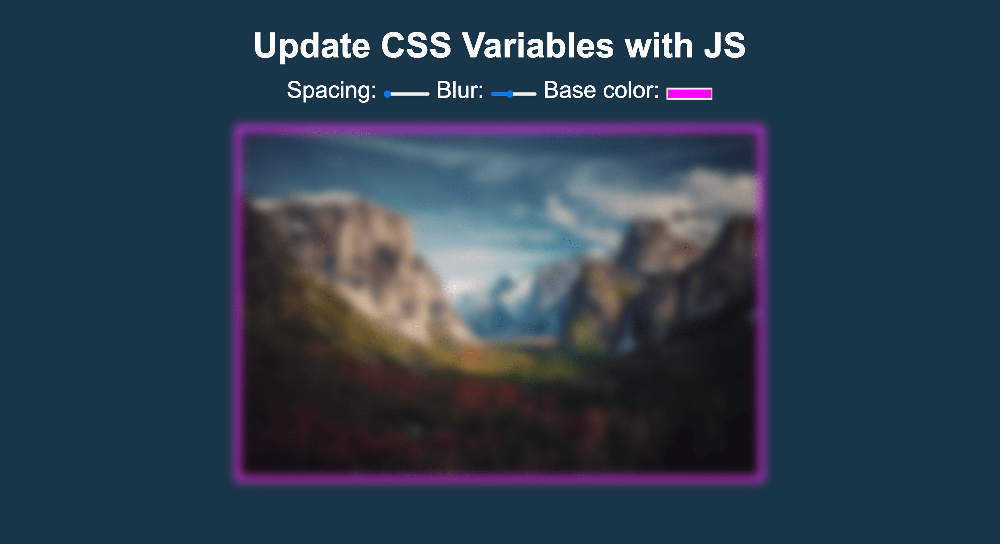

# 🗂️ CSS Variable with JS
 
A project where users can change CSS values of elements with Javascript

## 🚀 Features

- **Change variable properites**: A user can play the drums with keyboard keys that play sounds.

## 🛠️ Technologies

- `HTML`
- `CSS`
- `Javascript`

## ✍️ Article

- [Lessons learned](./Changing%20CSS%20Variables%20with%20Javascript.md)

## 📸 Screenshot

