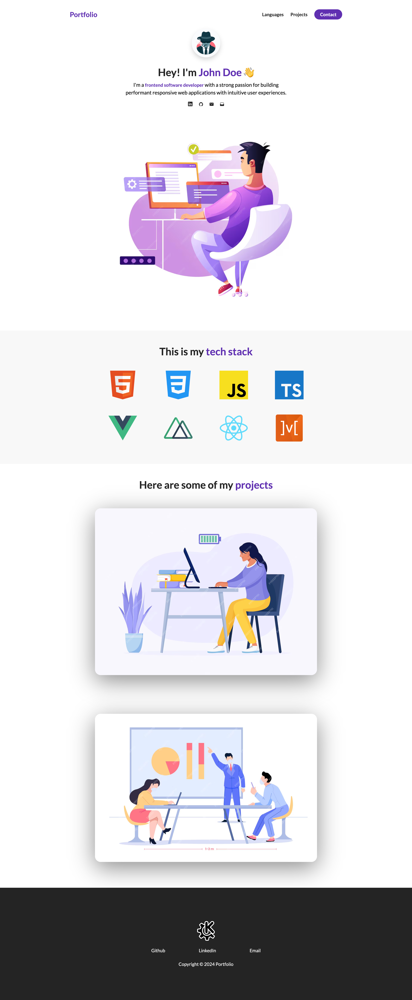

# 👋 Portfolio Template
 
Here we build a portfolio template that can be used to showcase projects. You can view the project live on Codepen [Here](https://codepen.io/benjaminkyamanywa/pen/rNRWLpx). 

## 🚀 Features

- **Modularized sections**: Sections to highlight content such as description, projects, contact me.
- **Responsive Design**: The site adopts to different screen widths without breaking changes to the layout.

## 🛠️ Technologies

- `HTML`
- `CSS`
- `Javascript`

## 📸 Screenshot

