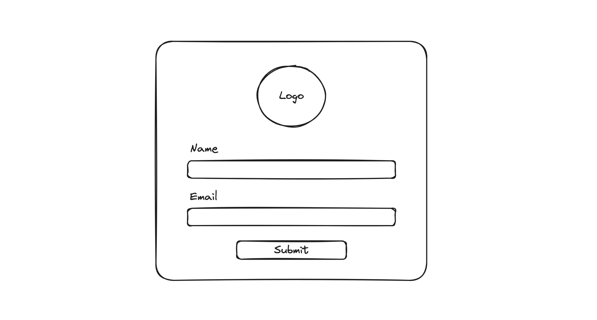

# Login Module
 
A use login module that requires a name and email with validation.

## 🚀 Features

- **User Login**: Requires users to add a valid username and email.

## 🛠️ Technologies

- `HTML`
- `CSS`
- `Javascript`

## 💡 Improvements

- **Authentication**: Add user authentication to verify details.
- **Sign Up**: Add a sign up version to allow user sign ups.

## 🐞 Issues

- Missing additional check like recaptcha to avoid bot submissions.

## 📸 Screenshot

