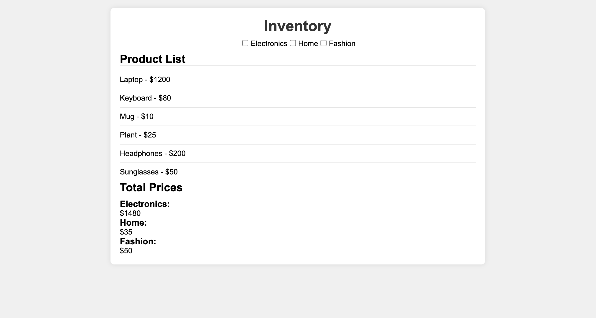

# 🏪 Inventory Filter
 
A project where users can filter inventory of items based on categories

## 🚀 Features

- **Filter**: A user can filter for different items within categories of products.

## 🛠️ Technologies

- `HTML`
- `CSS`
- `Javascript`

## ✍️ Article

- [Lessons learned](./Building%20a%20product%20filter.md)

## 📸 Screenshot

